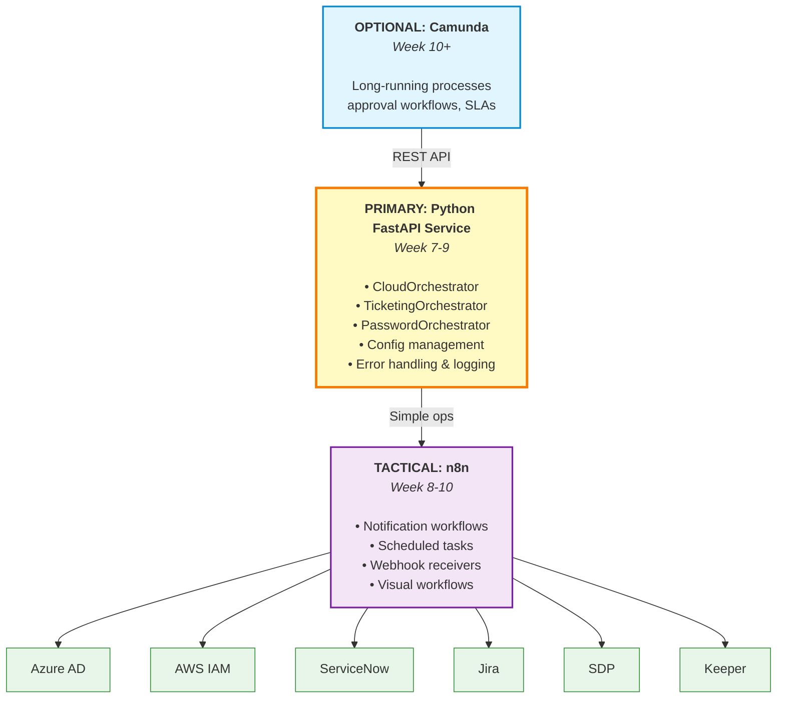

Eerste "brainstorm" diagram waarbij Python FastAPI als een tussenlaag fungeert in de vorm van de orchestrator waardoor in n8n nieuwe workflows (=tools) kunnen gebouwd worden op een low-code platform die communiceren met de orchestrator. Deze custom python layer fungeert vooral als interactieplek tussen intern en externe handelingen, zodat n8n niet te maken krijgt met credentials of andere sensitieve data maar enkel taken uitvoert doordat n8n heel veel "connectors" heeft. 

